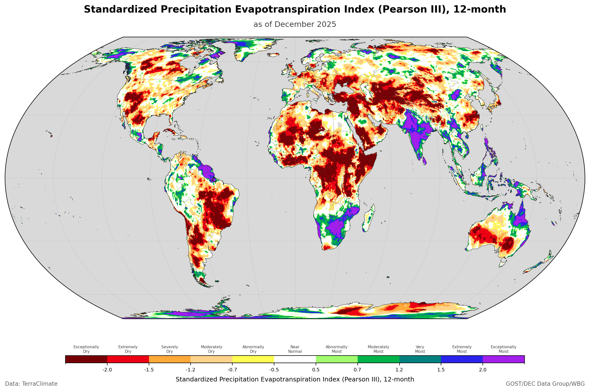

::: {.hero-banner}
::: {.hero-logo}

:::

::: {.hero-content}
# Monitor Climate Extremes with Confidence

A minimal, efficient Python implementation of **Standardized Precipitation Index (SPI)** and **Standardized Precipitation Evapotranspiration Index (SPEI)** for monitoring **both drought and wet conditions** using run theory.

<span class="badge-custom badge-python">Python 3.8+</span>
<span class="badge-custom badge-license">BSD-3-Clause</span>
<span class="badge-custom badge-status">Active Development</span>

[Get Started](get-started/installation.qmd){.btn .btn-primary .btn-lg role="button"}
[View on GitHub](https://github.com/bennyistanto/precip-index){.btn .btn-outline-light .btn-lg role="button"}
:::
:::

---

## Key Features

::: {.grid-container}
::: {.feature-card}
### Climate Indices

- **SPI** — Standardized Precipitation Index
- **SPEI** — Precipitation Evapotranspiration Index
- Multiple time scales (1, 3, 6, 12, 24 months)
- CF-compliant NetCDF output
:::

::: {.feature-card}
### Bidirectional Analysis

- Monitor **drought** (dry conditions)
- Monitor **floods** (wet conditions)
- Unified framework for both extremes
- Consistent methodology
:::

::: {.feature-card}
### Multi-Distribution Fitting

- **Gamma** — Standard for SPI
- **Pearson III** — Recommended for SPEI
- **Log-Logistic** — Better tail behavior
- Automatic fitting method selection
:::

::: {.feature-card}
### Run Theory Framework

- Event identification & characterization
- Duration, magnitude, intensity, peak
- Time-series and gridded analysis
- Period statistics for spatial patterns
:::

::: {.feature-card}
### Operational Mode

- **Save** fitted distribution parameters
- **Load** and apply to new data without refitting
- Production monitoring workflows
- Validated identical to fresh calculations
:::

::: {.feature-card}
### Scalable Processing

- Memory-efficient spatial tiling
- Process global-scale data (CHIRPS, ERA5)
- Automatic memory estimation
- Streaming I/O for large datasets
:::
:::

---

## Quick Example

::: {.panel-tabset}
### Basic Usage

```python
import xarray as xr
from indices import spi
from runtheory import identify_events
from visualization import plot_index

# Load precipitation data
precip = xr.open_dataset('precipitation.nc')['precip']

# Calculate SPI-12
spi_12 = spi(precip, scale=12)

# Or use different distributions
spi_12_p3 = spi(precip, scale=12, distribution='pearson3')

# Identify drought events using run theory
events = identify_events(spi_12.isel(lat=0, lon=0), threshold=-1.2)

# Visualize
plot_index(spi_12.isel(lat=0, lon=0), threshold=-1.2)
```

### Operational Mode

```python
from indices import spi, save_fitting_params, load_fitting_params

# Step 1: Calibrate on historical data and get parameters
spi_hist, params = spi(precip_historical, scale=12, return_params=True)

# Step 2: Save parameters for future use
save_fitting_params(params, 'spi12_gamma_params.nc',
                    scale=12, periodicity='monthly',
                    distribution='gamma',
                    coords={'lat': precip.lat.values,
                            'lon': precip.lon.values})

# Step 3: Later — load params and apply to new data (no refitting)
loaded = load_fitting_params('spi12_gamma_params.nc',
                             scale=12, periodicity='monthly',
                             distribution='gamma')
spi_new = spi(precip_new, scale=12, fitting_params=loaded)
```
:::

---

## Why precip-index?

::: {.callout-note}
## Production-Ready Monitoring

Calibrate distribution parameters on historical data, save them as NetCDF, and apply consistently to new observations — **no refitting needed**. This enables operational drought monitoring workflows where new satellite data is processed the moment it arrives, using the same statistical baseline every time. Validated to produce results identical to fresh calculations.
:::

::: {.callout-tip}
## Global-Scale Performance

Benchmarked on a workstation with 128 GB RAM:

- **CHIRPS v3 SPI-12** (0.05°, 17.3M cells, 539 months, ~69 GB) — **~2h 47m** with Gamma distribution, 12 spatial chunks
- **TerraClimate SPEI-12** (0.04°, 37.3M cells, 816 months, ~226 GB) — **~26h** with Pearson III distribution, 32 spatial chunks

Regional subsets (country-level) complete in seconds to minutes. Memory-efficient spatial tiling means you don't need a supercomputer. See [Performance Benchmarks](technical/implementation.qmd#performance-benchmarks) for detailed comparison.
:::

::: {.callout-important}
## Built on Standards

WMO 11-category drought/wet classification. CF-compliant NetCDF output. Run theory from peer-reviewed hydrology literature. Multiple PET methods (Thornthwaite, Hargreaves) with automatic fallback. Three distribution families each using their optimal fitting method (Method of Moments, MLE, L-moments).
:::

---

## Global Output

::: {.panel-tabset}
### SPI 12-month from CHIRPS


SPI-12 (Gamma) calculated from **CHIRPS v3** at 0.05° resolution.

### SPEI 12-month from TerraClimate



SPEI-12 (Pearson III) calculated from **TerraClimate** at 0.0417° ~ 4km resolution.
:::

---

## Validation Results

All distributions tested against TerraClimate Bali data (1958–2024). Cross-distribution correlation exceeds 0.98. The test suite generates **28 visualizations** including advanced analytics and operational mode validation.

::: {.panel-tabset}
### Multi-Scale SPI


SPI at 1-, 3-, 6-, 12-, and 24-month scales. Each captures different drought types: meteorological, agricultural, hydrological, and socioeconomic.

### Distribution Comparison


Three distributions produce consistent SPI-12 time series with correlation > 0.98 between all pairs.

### PET Methods


PET method comparison: Thornthwaite vs Hargreaves vs TerraClimate (Penman-Monteith). Hargreaves correlates better with the reference (r=0.80 vs r=0.75).

### Seasonal Heatmap


Seasonal drought heatmap showing month-by-year patterns. Major droughts (1997, 2015, 2019) appear as vertical red bands.

### Historical Events


Run theory analysis identifies and ranks historical drought/wet events by magnitude.

### Decadal Trends


Long-term analysis showing drought frequency, mean index, and trends by decade.

### Climate Stripes


Climate stripes visualization showing annual drought conditions from 1959-2024. Red = drought years, blue = wet years.

### Exceedance Probability


Risk assessment plot showing probability of exceeding drought thresholds with return period annotations.

### Operational Mode


Parameter persistence for real-time monitoring: calibrate once on historical data, apply consistently to new observations. Results are identical to fresh calculations.
:::

See [Validation & Test Results](technical/validation.qmd) for detailed analysis.

---

## Getting Started

::: {.grid-container}
::: {.feature-card}
### Installation

Install dependencies and clone the repository.

[Install Now](get-started/installation.qmd){.btn .btn-primary}
:::

::: {.feature-card}
### Quick Start

Calculate your first SPI/SPEI in minutes.

[Quick Start](get-started/quick-start.qmd){.btn .btn-primary}
:::

::: {.feature-card}
### Tutorials

Learn through interactive examples with real data.

[View Tutorials](tutorials/01-calculate-spi.qmd){.btn .btn-primary}
:::
:::

---

## Documentation

- **[User Guide](user-guide/index.qmd)** — SPI, SPEI, run theory, and visualization
- **[Technical Docs](technical/index.qmd)** — Methodology, implementation, API reference
- **[Validation](technical/validation.qmd)** — Test results and comparison plots
- **[Changelog](changelog.qmd)** — Version history

---

## Credits

::: {.credits-section}
**Benny Istanto**, GOST/DEC Data Group, The World Bank

Developed to support operational hydrometeorological monitoring — enabling the World Bank to regularly assess extreme dry and wet periods across regions.

Built upon the foundation of [climate-indices](https://github.com/monocongo/climate_indices) by James Adams, with substantial modifications for multi-distribution support, bidirectional event analysis, and scalable processing.
:::

---

## Citation

```bibtex
@software{precip_index_2026,
  author = {Istanto, Benny},
  title = {Precipitation Index: SPI & SPEI for Climate Extremes Monitoring},
  year = {2026},
  url = {https://github.com/bennyistanto/precip-index},
  version = {2026.1}
}
```

---

## Contributing & License

We welcome contributions! See our [GitHub repository](https://github.com/bennyistanto/precip-index) for bug reports, feature requests, and pull requests. Licensed under [BSD-3-Clause](https://github.com/bennyistanto/precip-index/blob/main/LICENSE).

::: {.callout-warning}
## Active Development

This package is under active development. APIs may change. Please report issues on [GitHub](https://github.com/bennyistanto/precip-index/issues).
:::
